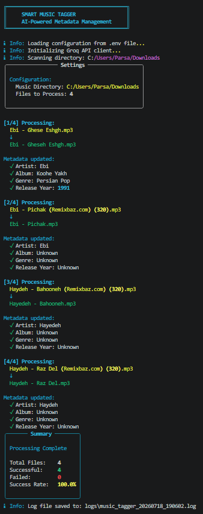
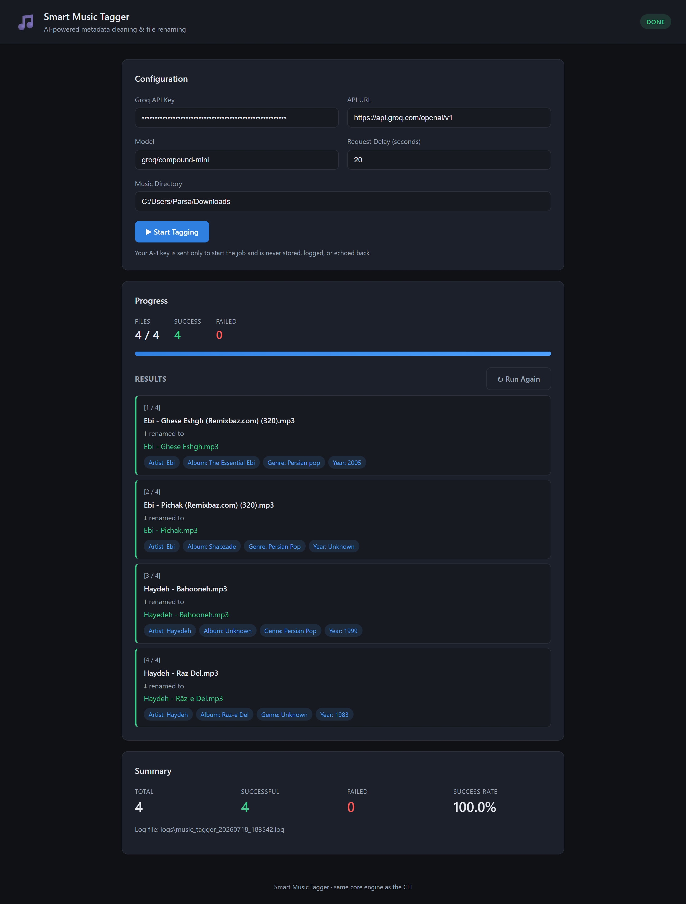

# Smart Music Tagger – Quick Start Guide

Get Smart Music Tagger up and running in just a few minutes.

---

## Installation

Install the required dependencies:

```bash
pip install -r requirements.txt
```

---

## Configuration

> **Note:** Configuration via `.env` is only required for the CLI. The Web GUI lets you enter all required settings directly from the graphical interface.

### Copy the configuration file (CLI only)

```bash
cp .env.example .env
```

Edit the `.env` file:

```env
GROQ_API_KEY=your_groq_api_key
GROQ_API_URL=https://api.groq.com/openai/v1
GROQ_MODEL=groq/compound-mini
GROQ_REQUEST_DELAY_SECONDS=5
MUSIC_DIRECTORY=C:/Users/YourName/Music
```

### Required Variables

| Variable | Description |
|----------|-------------|
| `GROQ_API_KEY` | Your Groq API key |
| `GROQ_API_URL` | Groq API endpoint |
| `GROQ_MODEL` | AI model used for metadata extraction |
| `GROQ_REQUEST_DELAY_SECONDS` | Delay between API requests |
| `MUSIC_DIRECTORY` | Directory containing your music library |

> **Important:** Never share or commit your `.env` file. It contains your private API key.

---

## Running

Smart Music Tagger provides two front-ends that share the same processing engine.

### Command Line Interface

The CLI reads all required settings from the `.env` file.

```bash
python cli_main.py
```

### Web Interface

The Web GUI does **not** require a `.env` file. Enter your API key, model, request delay, and music directory directly through the graphical interface.

```bash
python gui_main.py
```

Then open:

```text
http://127.0.0.1:5000
```

---

## What It Does

For every supported audio file, Smart Music Tagger automatically:

- Scans your music directory
- Analyzes filenames with AI
- Extracts accurate metadata
- Updates audio tags
- Renames files to a consistent format
- Generates a processing log

---

## Screenshots

<table align="center">
<tr>

<td align="center">
<b>CLI</b><br><br>

</td>

<td width="24"></td>

<td align="center">
<b>Web GUI</b><br><br>

</td>

</tr>
</table>

---

## Before & After

### Before

- `Eminem - Lose Yourself 320kbps.mp3`
- `scorpions - wind of change (Official Video).flac`
- `the_beatles_let_it_be.wav`
- `Dua Lipa - Levitating (Lyrics Video) (128).m4a`
- `The Weeknd - Blinding Lights [Official] (2020).ogg`

### After

- `Eminem - Lose Yourself.mp3`
- `Scorpions - Wind Of Change.flac`
- `The Beatles - Let It Be.wav`
- `Dua Lipa - Levitating.m4a`
- `The Weeknd - Blinding Lights.ogg`

---

## Supported Formats

| Format | Extension |
|---------|-----------|
| MP3 | `.mp3` |
| FLAC | `.flac` |
| WAV | `.wav` |
| M4A | `.m4a` |
| OGG | `.ogg` |

---

## Updated Metadata

### Audio Tags

The following metadata is updated whenever available:

- Title
- Artist(s)
- Album
- Genre
- Release Year
- Track Number

### File Naming

Files are renamed using the format:

```text
Artist - Song.extension
```

For multiple artists:

```text
Artist 1 and Artist 2 - Song.extension
```

The renamer also removes common filename noise such as:

- Bitrate labels
- "Official Video"
- "Lyrics"
- Duplicate information
- Other unnecessary text

---

## Logs

A detailed log is generated after every run.

**Location**

```text
logs/music_tagger_YYYYMMDD_HHMMSS.log
```

Each log contains:

- Original filename
- New filename
- Extracted metadata
- Success or failure status
- Error messages
- Processing summary

---

## Project Architecture

```text
                 User Configuration
                         │
                         ▼
          cli_main.py / gui_main.py
                         │
                         ▼
              Core Processing Engine
                         │
     ┌─────────────┬──────────────┬─────────────┐
     ▼             ▼              ▼
 File Scanner   Groq Client   File Processor
                                      │
                                      ▼
                             Metadata Writer
                                      │
                                      ▼
                               File Renamer
                                      │
                                      ▼
                                   Logger
```

---

## Security Notes

- Never commit your `.env` file to version control.
- Use `.env.example` as the configuration template.
- Keep your API key private.
- The repository already ignores `.env` via `.gitignore`.

---

For additional information, see:

- `README.md`
- `.env.example`
- `logs/`